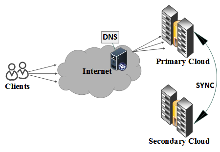
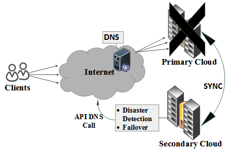
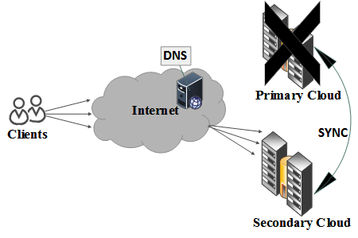

## Synopsis

Failover is an important component of disaster recovery. It is a mechanism of routing the users’ traffic to the DR site, after the disaster gets confirmed in the primary site. In this project, the implementation of different automatic failover schemes is presented and tested for Disaster Recovery as a Service (DRaaS) in OpenStack. These Failover schemes are:
   • DNS Based Failover
   • Frontend Based Failover
   • Hybrid Based Failover.
Under different disaster scenarios, these automatic failover schemes are experimented and analyzed. These results suggest that a Hybrid scheme is more likely to recover quickly from the different levels of disaster.

## Prerequisites

• For any scheme to be used, at least two machines are required with OpenStack deployed on each.
• For DNS and Hybrid based scheme, account of NO-IP is required with at least one hostname provided by this (NO-IP is an open source DNS and Dynamic DNS service providers, for more info visit http://www.noip.com/)
• For Frontend scheme, you must have one extra machine. For Hybrid scheme you must have two extra machines apart from OpenStack deployed machines.
• Python 2.7 environment on each machine.

## Info Graphics
@DNS-based-failover
    

## Installation

Clone this project, and navigate to dns_based directory. Inside this directory there are two directories as well named drass-primary and drass- secondary. For any failover scheme, these two setup directories are compulsory to provide data synchronization between two main openstack nodes. Place drass-primary into the primary openstack node and draas-secondary into the secondary openstack node.
Both these directories contain some configuration files (draas.conf, keystone.conf, etc). These files are commented so you can figure out it that how to configure them according to your environment.
Once you get done with configuration, then just run the draas-primary.sh and draas-secondary.sh in the respected nodes. For choosing the failover scheme, you have to enable the required scheme name in failover.conf file. Finally just run the Draas.py file by typing ‘python Draas.py’. Same process would be applied on the secondary node. Note: first you need to run Draas.py on secondary site and then on primary site.

If you enable DNS-based scheme, then you don’t need any extra machine other than openstack deployed machines, the DNS code is integrated within the setup files of draas-primary and draas-secondary. If you choose frontend-based scheme then you must have one extra machine (without OpenStack deployment) to run the frontend-based code over there. To run the frontend code, you need to do some configurations in frontend.conf file which is contained in frontend-based directory. The file is commented so you can easily figure out it what things you need to configure. After this configuration, just run the ‘frontend.py’ file. If you choose hybrid-based scheme then you must have two extra machines. On first machine, place the hybrid-primary and on the second machine place the hybrid-secondary directory setup files. Again you need to do the mentioned configurations in the hybrid.conf files contained in setup files of both these machines. After this configurations, just run the ‘hybrid.py’ file first in hybrid-secondary and then in hybrid-primary machine respectively.

Note: Any failover scheme you choose to proceed with, you must have two machines with OpenStack deployed on each. After running the DraaS.py file on both, they must be having in synchronization state with each other in order to sync the data and logs.   

## Tests

If you want to test these schemes in order to measure the RTO or total downtime then run the TestingRTO.py file after updating with your hostname in the file.

## Contributors

Supervisors: Dr. Adnan Iqbal and Dr. Saqib Ilyas

 
## License

https://www.namal.edu.pk/pdrg/
